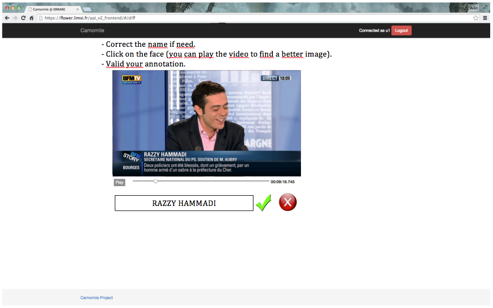

# Collaborative annotation of MediaEval "Person Discovery" data

## Annotation tool #1: Evidences

#### Input data: 
 - Person name
 - A shot of a video
 - Evidence type (audio for pronounced names, image for written names)
 - Already corrected name near from the person name

```json
{
    "personName": "nicolas_sarkozi",
    "shot": _ID_SHOT,
    "source": "image",
    ... ??? ...
}
```

`GET /annotation/_ID_SHOT` can be used to get more info about the shot (medium, start time and end time).

#### Scenario:
 - Show the person name
 - Show the shot of the video to be annotated (+/- 5 seconds for audio evidence)
 - Ask to the annotator to:
   + Play the video to find the evidence
   + Correct the name if needed
   + Draw a bounding box on the face
   + Select the best timestamp for the annotation (when the face is the more front)
   + Validate or reject the annotation (if there is no written name or pronounced name corresponding to the person name)
 - What happens behind after validation:
   + If not existing, create the mapping layer between the evidence submission and the corrected name
   + Add the mapping if it not exists



## Annotation tool #2: talking faces

#### Input data: 
 - A shot of a video
 - A list of label proposed by the submissions for this shot
 - The mapping list to correct the person names
 - The evidence images

```json
{
    "shot": _ID_SHOT,
    "personName": ["nicolas_sarkozi", "francois_hollande", ...],
    ... ??? ...
}
```


#### Scenario:
 - Showing the shot in a loop play
 - Creating a list of person images that can be present in the shot (based on participant submissions):
   + Correcting of the person names in the submissions with the mapping
   + Counting the number of occurences for each person names corrected
   + Finding the best evidence corresponding to these person names corrected
   + Ranking of these evidences based on the number of occurrences
 - Showing the first three best evidences (the video of the evidence stop at the annotated timestamp and with the bounding box)
 - Showing a button to add evidences if needed
 - Asking to the annotator for each evidences selected to:
   + Move on the left once evidences where the corresponding person appears
   + Move on the left twice evidences where the corresponding person appears **AND** speaks
   + If an other person appears and speaks in the shot, to:
     * Clic on the button **add** -> shows a list of additionnal evidence
     * Select the good evidence or the question mark button
   + Validate the annotation
   
 
