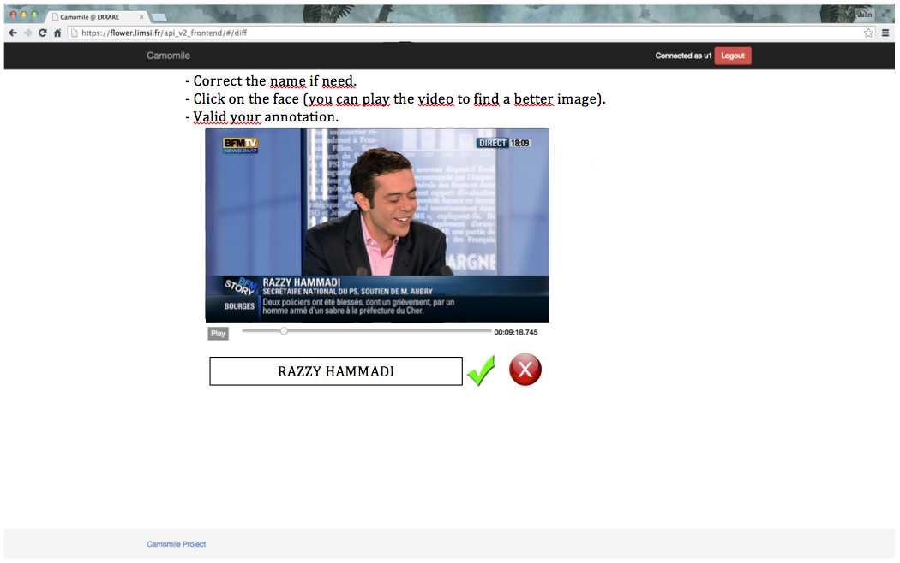
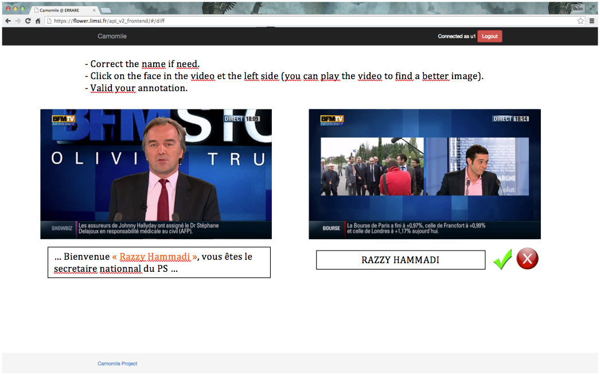
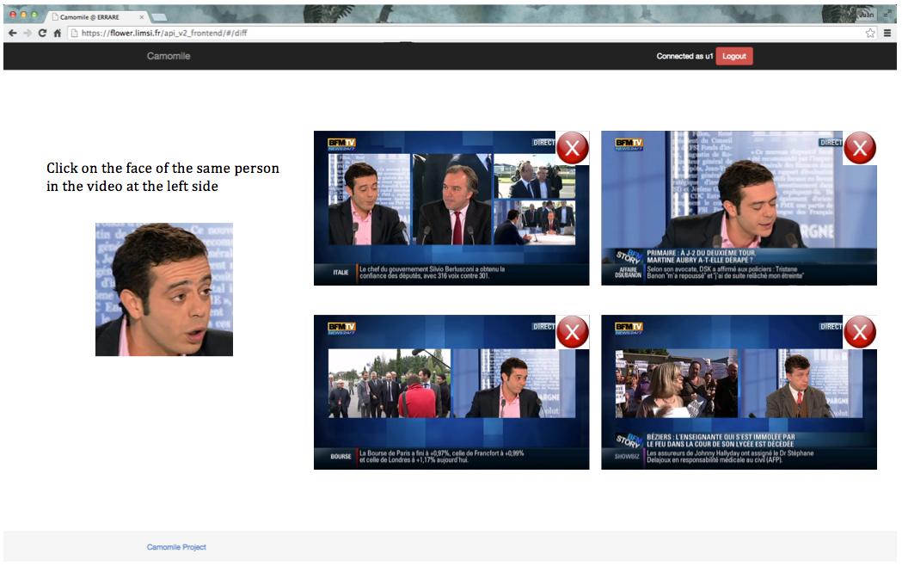
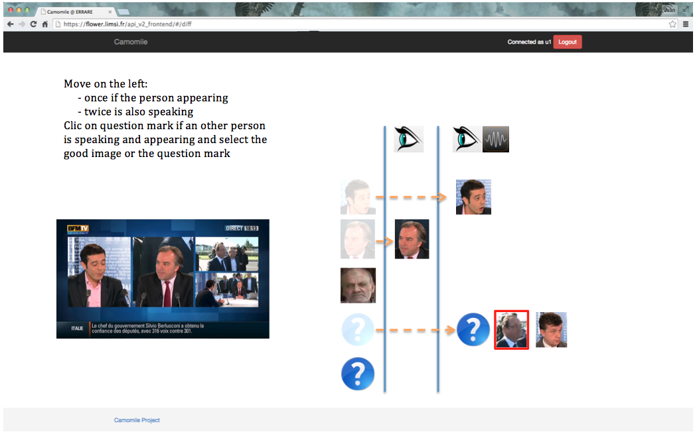

# StoryBoard

The goal is to corrected submission of participants. We want to split the process in multiple sub annotation

## Written names evidence annotation

#### Input data: 
 - Person name
 - VideoID 
 - ShotID
 
#### Scenario :
 - We write the name of the person used as evidence
 - We show shot of the video to annotate
 - We ask to the user:
   * to correct the name
   * to draw a square on the face
   * to click on a button to validate the annotation or to reject the annotation
 

## Pronounced names annotation

#### Input data: 
 - Person name
 - VideoID 
 - ShotID

#### Scenario :
 - We write the name of the person used as evidence
 - We show shot of the video +/- 5 seconds to annotate
 - Th  noatator play the vide

 - On affiche la segment vidéo où apparait la personne, calée sur le timestamp fourni.
 - On joue la vidéo pendant 20 secondes pour vérifier si le bon nom a été prononcé
 - On demande à l'utilisateur de cliquer sur le visage correspondant au nom.
 - Si l'annotateur ne voit pas la personne correspondante dans l'image affiché, elle peut lire le plan de la vidéo pour trouver une meilleur image.
 - Si elle ne trouve pas la personne, elle clique sur un bouton.
 - Correction du nom de la personne ???
 
 

 
## Vérification de l'identité des visages

#### Input data: 
 - Une image d'un visage
 - Une liste de plan de vidéos

#### Scenario :
- On affiche l'image d'une preuve + un nom.
- On affiche une liste d'imagettes correspondant au centre de chacun des plans à annoter pour une vidéo.
- Si la personne correspondante est visible, l'annotateur clique sur son visage.
- Si la personne n'est pas visible, l'annotateur peut chercher une meilleur image dans le plan en lisant la vidéo.
- Si la personne n'apparait pas dans le plan, elle clique sur un bouton.

 

## Vérification si les visages parlent

#### Input data: 
 - Un plan d'une vidéo

#### Scenario :
- On affiche un plan avec un visage entouré (celui sur lequel l'annotateur a cliqué dans l'étape précédente).
- L'annotateur joue la vidéo est vérifie si la personne parle dans le plan.

On peut utiliser un classifieur pour savoir si le visage parle ou non, et l'on annote manuellement que les cas négatifs ou limites

 
