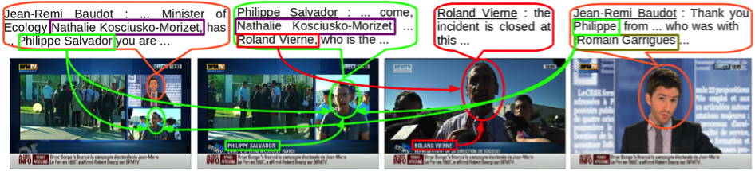

# Task proposal for MediaEval 2015

## Task description

### Task title

```
Give your task an informative title.
```

Multimodal person discovery in TV Broadcast

```
Proove it: Unsupervised Person Discovery in TV Broadcast
Buzzinga!  Multi-modal  ______ Spotting  _______________  
           Cross-modal  ______ Naming    _______________
```

### Introduction

```
Describe the motivating use scenario, i.e,. which application(s) motivate the task. 
State what the task requires of participants.
```

This task is trying to re-imagine the (now completed) REPERE challenge, which focused on multimodal person recognition in TV broadcast. 
The main objective of this challenge was to answer the two questions **who speaks when?** and **who appears when?** using any sources of information (including pre-existing biometric models and person names extracted from text overlay and speech transcripts).

TV archives maintained by national institutions such as French INA, Dutch Sound&Vison or the BBC are getting bigger everyday.
Automatically creating indexes to make those archives searchable may lead to lots of potentially very useful applications.

One of the most promising indexes is **people**. People are interested in people by nature. 
One day or another, anyone may start buzzing and become a trending topic on social networks or search engines.
It is however impossible to predict who is going to buzz and who isn't, making it difficult to generate a list of person of interests in advance.

Therefore, biometric models for some people may not be available at indexing time, simply because they are not (yet) famous.
Even worse, archivist human annotators may not even know their name! 

Hence, unsupervised algorithms (*i.e.* not relying on any biometric models) are needed.
To ensure high quality indexes, those algorithms should also help human annotators double-check these indexes by providing a proof of the claimed identity (especially for people that are not yet famous).

#### Main task

Given a collection of TV broadcasts pre-segmented into shots, participants are asked to provide, for each shot, the list of names of persons speaking AND appearing at the same time.

The main novelty is that the list of persons is not provided *a priori* and the use of pre-existing biometric models (either from voice or from face) is forbidden. The only way to identify a person is by finding their name in the audio (*e.g.* using automatic speech recognition) or visual (*e.g.* using optical character recognition) streams and associating them to the correct person - making the task completely unsupervised.



Participants are also asked to provide a proof for every result they return.
A proof is a short temporal video fragment making it clear (from a human perspective) what the name of the person is. For instance, it can be a different shot where the same person is introduced by a text overlay containing their name (`proofSource = OCR`), or the same shot where the person introduces themself (`proofSource = ASR`).

```
shotVideo shotStartTime shotEndTime First-Name_LAST-NAME confidence proofSource proofVideo proofStartTime proofEndTime
```
  * `shotVideo`: unique identifier of the video
  * `shotStartTime`: shot start time (in seconds)
  * `shotEndTime`: shot end time (in seconds)
  * `First-Name_LAST-NAME`: unique identifier of the person
  * `confidence`: the higher, the more confident
  * `proofSource`: `ASR` or `OCR`
  * `proofVideo`: unique identifier of the proof video
  * `proofStartTime`: proof start time (in seconds)
  * `proofEndTime`: proof end time (in seconds)

#### Optional task

As we expect most submissions to internally rely on two-steps approaches (*i.e.* speaking-face diarization followed by propagation of detected names), an optional task is dedicated to the evaluation of underlying audio-visual diarization technologies.

In this optional task, participants are asked to provide a temporal segmentation of the whole test corpus containing every temporal fragment where at least one person is speaking and appearing at the same time. Moreover, each person should be uniquely identified by an anonymous label (*e.g.* `person1`, `person2`, ...)

```
video startTime endTime personLabel
```
  * `video`: unique identifier of the video
  * `startTime`: fragment start time
  * `endTime`: fragment end time
  * `personLabel`: unique identifier of the person

### Target group

```
Describe the type of researchers who would be interested in participating in the task.
```

This task targets researchers from several communities including multimedia, computer vision, speech and natural language processing. Though the task is multimodal by design and necessitates expertise in various domains, the technological barriers to entry is lowered by the fact that the automatic output of various sub-modules will be provided to all participants:

  * speaker diarization,
  * face detection and tracking,
  * automatic speech transcription,
  * optical character recognition,
  * named entity detection

For instance, a researcher from the speech processing community could focus its research efforts on improving speaker diarization and automatic speech transcription, while still being able to rely on provided face detection and tracking results to participate to the task.

### Data

```
Describe the data set, including how the data will be collected an licensed.
```

The REPERE data set (137 hours) will be dividing into two parts: a development set used to tune the fusion system and a test set. We split the corpus to have the minimum overlap between persons present in the two subsets, which will avoid the use of biometric models.
50 hours are already manually annotated:

  * Audio: speech transcript, named entities, speech segmentation, speech identification
  * Image (1/10 seconds): face segmentation and identification, overlaid text transcription, mark on person name in overlaid text,
  * Complete face tracking on 10 hours

### Evaluation methodology

```
Describe the evaluation methodology, including how the ground truth will be created.
```

#### Main task

The main task will be evaluated as an Information Retrieval (IR) task.  
`TO BE DISCUSSED`: using inferred average precision?

Requests (*e.g.* `First-Name_LAST-NAME`) will be selected a posteriori (*i.e.* after runs have been submitted) among the list of people returned by participants to the task and the list of people extracted from the part of the test set which is already annotated.

`TO BE DISCUSSED`: we also plan to use `Google Trends` for a particular person to only evaluate a request on the subset made of the videos whose broadcast date matches the date where the person was actually buzzing.

Ground truth will be created a posteriori by manually checking the top N shots (according to the `confidence` score) returned by each participants for each query. For each shot, both the person name itself (`Relevant`, `Irrelevant`, `Unsure`) and its proof (`Correct` or `Incorrect`) will be evaluated.

  * A shot is `Relevant` if the annotator knows (based on personal knowledge) the name is correct or the proof makes it clear it is correct.
  * A shot is `Irrelevant` if the annotator knows (based on personal knowledge) the name is incorrect or the proof makes it clear it is incorrect.
  * A shot is `Unsure` if the annotator does not know the person and the proof does not help either.
  * A proof is `Correct` if it makes it clear the person name is correct.
  * A proof is `Incorrect` if it does not.

`TO BE DISCUSSED`: we also plan to ask participants to help annotating the corpus through the `CAMOMILE` annotation web-app.

Two variants of precision and recall will be used (taking or not the proof into account) depending on how the number of relevant answers is computed.

```
VARIANT 1: # relevant = number of relevant shots
```

```
VARIANT 2: # relevant = 0.5 x number of relevant shots + 0.5 x number of correct proofs
```

The recall will be not exhaustive (the whole corpus can't be annotated completely). It depending on the number of shots annoted a posteriori. The number of shots to return is limited to N shots (N will be decided based on the annotations that we could do).

For example, if N equal 30:

1st case: There is more than 30 shots annotated during the post-eval
 - p1 returns 25 shots with 21 corrects (precision = 21/25)
 - p1 returns 30 shots with 27 corrects (precision = 27/30)
 - 41 shots are annotated during the post-eval with 37 corrects: recall_P1 = 25/30, recall_P2 = 27/30

2st case: There is less than 30 shots annotated during the post-eval
 - p1 returns 5 shots with 4 corrects (precision = 4/5)
 - p1 returns 12 shots with 8 corrects  (precision = 8/12)
 - 15 shots are annotated during the post-eval with 9 corrects: recall_P1 = 4/9, recall_P2 = 8/9

An online adjudication interface will be opened after the first round of evaluations to solve remaining ambiguous cases.


#### Optional task

The optional task will be evaluated on a subset (10 hours) of the test set which is already densely annotated in terms of people speaking AND appearing at the same time. We will use the Diarization Error Rate (DER) classicaly used in the speech community.


### References and recommended reading

```
List 3-4 references related to the task that teams should have read before attempting the task.
```

#### Paper by REPERE challenge 2013 organizers

G. Bernard, O. Galibert, J. Kahn  
[*The First Official REPERE Evaluation*](http://ceur-ws.org/Vol-1012/papers/paper-08.pdf)  
SLAM 2013, First Workshop on Speech, Language and Audio for Multimedia  

#### Paper by REPERE corpus creators

A. Giraudel, M. Carré, V. Mapelli, J. Kahn, O. Galibert, L. Quintard  
[*The REPERE Corpus: a Multimodal Corpus for Person Recognition*](http://www.lrec-conf.org/proceedings/lrec2012/pdf/707_Paper.pdf)  
LREC 2014, Eight International Conference on Language Resources and Evaluation  

#### Paper by REPERE challenge 2014 winning consortium

F. Bechet, M. Bendris, D. Charlet, G. Damnati, B. Favre, M. Rouvier, R. Auguste, B. Bigot, R. Dufour, C. Fredouille, G. Linarès, J. Martinet, G. Senay, P. Tirilly  
[*Multimodal Understanding for Person Recognition in Video Broadcasts*](http://pageperso.lif.univ-mrs.fr/~benoit.favre/papers/favre_interspeech2014b.pdf)  
InterSpeech 2014, Fifteenth Annual Conference of the International Speech Communication Association  

#### Papers by the organizers

H. Bredin, A. Laurent, A. Sarkar, V.-B. Le, S. Rosset, C. Barras  
[*Person Instance Graphs for Named Speaker Identification in TV Broadcast*](http://cs.uef.fi/odyssey2014/program/pdfs/27.pdf)  
Odyssey 2014, The Speaker and Language Recognition Workshop  

J. Poignant, L. Besacier, G. Quénot  
[*Unsupervised Speaker Identification in TV Broadcast Based on Written Names*](https://hal.archives-ouvertes.fr/hal-01060827/document)  
IEEE/ACM Transactions on Audio, Speech, and Language Processing  

### List of task organizers

  * Johann Poignant (LIMSI/CNRS)
  * Claude Barras (LIMSI/Université Paris-Sud)
  * Hervé Bredin (LIMSI/CNRS)
  * Gilles Adda (LIMSI/IMMI/CNRS)
  * Juliette Kahn (LNE) ?
  * Sylvain Meignier (LIUM) ?
  * Georges Quénot (LIG) ?

## Task blurb

```
Write 2-3 sentences that summarizes key information on the task.
It should be informative and well- crafted to attract potential participants. 
A standard pattern is to have each sentence answer in turn the major questions about the task: 
First sentence: What is the input and the output of the algorithm that participants need to design for the task?
Second sentence: What is the data? 
Third sentence: How is the task evaluated?
```

Given raw TV broadcasts, each shot must be automatically tagged with the name of people both audible and visible.
The list of people is not known a priori and their names must be discovered in an unsupervised way from text overlay or speech transcripts.
The task will be evaluated on the extended REPERE corpus using standard information retrieval metrics based on a posteriori collaborative annotation of the corpus.

## Task organization team

```
Write a short paragraph describing the organizing team. 
Your team should be large enough to handle organizing the task. 
Teams should consists of members from multiple research sites and multiple projects. 
A mix of experienced and early-career researchers is recommended. 
Note that your task team can add members after the proposal has been accepted.
```

## Survey questions
```
Write a list of questions (3-5) that you would like to include on the survey. 
These questions help you to ascertain the preferences of the research community for the aspects 
of the design of the task formulation, the data set design, and the evaluation methodology. 
For examples of the types of questions asked by tasks, please have a look at this .pdf
for the MediaEval 2013 survey.
```

- What is your opinion about selecting requests according to Google Trends.
  * Very interested
  * Not interested

- Do you think that we should add requests for the anchors and journalists?
 * Yes
 * No

- The answers to the requests should be on people:
 * Speaking AND appearing
 * Speaking AND/OR appearing

- How much data do you need for the development set (there is no training data, systems should be unsupervised)?
 * 5 hours
 * 10 hours
 * 20 hours

- How much time can you devote to the post-annotation to increase the number of evaluated requests:
 * 0 hours
 * 25 hours
 * 50 hours
 * 75 hours
 * 100 hours

- If any additional comments, questions or suggestions about this task occurred to you while you were answering the detailed questions, it would be helpful if you could enter them here:
